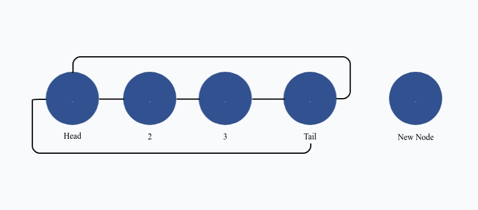

# Creating a *Safe* linked list in Rust.
While most languages provide access to pre-made data structures, it is still beneficial to teach the creation of these structures. Rust complicates this by making it more difficult to create them with `safe` code and simultaneously suggesting the avoidance of `unsafe` code where possible. Many implementations of a `safe` *linked list* exist for Rust. This implementation will attempt to differentiate itself from those by aiming for usability.

## Required structures:
### `LinkedList` - *The main structure; used to create and access a new linked list.*
<details>
<summary>Notes</summary>

- This implementation is **NOT** meant to be used in any real way. If a *linked list* is needed, see [`std::collections::LinkedList`](https://doc.rust-lang.org/std/collections/struct.LinkedList.html).

- This *linked list* implementation is *circular*, that means that the last *node* points forward to the first *node* and the first *node* points back to the last *node*.

- This *linked list* implementation requires the following [`use` declarations](https://doc.rust-lang.org/reference/items/use-declarations.html):
  - `use std::{cell::RefCell, rc::Rc};`

- This current implementation is currently lacking some features such as the ability to remove a `Node`.

</details>

```
pub struct LinkedList<T: Clone + Default>
{
    head: Option<Rc<RefCell<Node<T>>>>,
    tail: Option<Rc<RefCell<Node<T>>>>,
}
```
<details>
<summary><B>&lt;T: Clone + Default&gt;</b></summary>

This states that the type, `T`, requires implementation of `Clone` and `Default` in order to be valid for the *linked list* implemenation.
</details>
<details>
<summary><B>Option&lt;Rc&lt;RefCell&lt;Node&lt;T&gt;&gt;&gt;&gt;</b></summary>

- This type will be used to contain our *Nodes* throughtout the structures.
- [`Option`](https://doc.rust-lang.org/std/option/index.html)
  - This is used to allow the option of an empty *node* or *linked list*.
- [`Rc`](https://doc.rust-lang.org/std/rc/index.html) is a container to a *reference counted* object.
  - *Reference counted* objects can have multiple owners.
  - Owners are counted and once all owners are removed, so is the internal object.
- [`RefCell`](https://doc.rust-lang.org/std/cell/index.html) is for interior mutability.
  - *Reference counted* objects cannot be mutated.
  - `RefCell` solves this by creating an interface to the wrapped object which provides borrow features. Borrows can be mutable or immutable.
    - Any number of immutable borrows may exist at one time.
    - In order to borrow mutably, however, it must be the only active borrow.
</details>

### Node - *The secondary structure; used to hold values and offer links.*
```
#[derive(Clone)]
pub struct Node<T: Clone + Default> {
    pub value: T,
    next_node: Option<Rc<RefCell<Node<T>>>>,
    prev_node: Option<Rc<RefCell<Node<T>>>>,
}
```
<details>
<summary><B>#[derive(Clone)]</b></summary>

- Used to auto-implement the [`Clone trait`](https://doc.rust-lang.org/std/clone/trait.Clone.html).
</details>

### LinkedListIter - *The last structure; used to implement an iterator.*

```
pub struct LinkedListIter<T: Clone + Default> {
    head: Option<Rc<RefCell<Node<T>>>>,
    cur_node: Option<Rc<RefCell<Node<T>>>>,
}
```

## Implemenation:
With the required structures out of the way, implementation can begin.

### Node

Since the implementation of `LinkedList` is dependent on a *node*, implementation will start with a `Node`.

```
impl<T: Clone + Default> Node<T> {
}
```

#### The node will require four functions (`new`, `next` , `prev`, and `mutate`):

##### `new()`:
New simply creates and returns a new `Node<T>` structure. In the original structure definitions one requirement was that type `T` implement the [`Default trait`](https://doc.rust-lang.org/stable/std/default/trait.Default.html). The function `new()` takes advantage of that to initiate the `Node`'s `value`. It then sets next_node and prev_node to None.
```
fn new() -> Node<T> {
    Node {
        value: T::default(),
        next_node: None,
        prev_node: None,
    }
}
```

##### `next(&self), prev(&self)`:
Next and Previous functions add usability to the *linked list*. This is how the *linked list* gets the chaining behavior you would expect from another language. These two functions are nearly identical to each other.

<details>
<summary>Detailed explanation...</summary>

- First ensure that the linked `Node` is not `None`.
  - Since this *linked list* is *circular* every *node* should always have a next and previous *node*. If it doesn't something went majorly wrong, hence the use of panic!
- If the link does exist:
  - A reference to `next_node` or a *clone* of `next_node` is required, this implementation will take a reference.
  - The reference is unwrapped, and borrowed.
    - This creates a `Ref<Node<T>>`
    - Since returning a `Ref<Node<T>>` creates a hanging reference which can cause a crash when attempting to mutate a value, it is then *cloned* into a `Node<T>`

</details>


```
pub fn next(&self) -> Node<T> {
    if self.next_node.is_some() {
        let next_ref = self.next_node.as_ref();
        let next_unwrap = next_ref.unwrap();
        let next_borrow = next_unwrap.borrow();
        next_borrow.clone()
    } else {
        panic!("No `next` available!");
    }
}
pub fn prev(&self) -> Node<T> {
    if self.prev_node.is_some() {
        let prev_ref = self.prev_node.as_ref();
        let prev_unwrap = prev_ref.unwrap();
        let prev_borrow = prev_unwrap.borrow();
        prev_borrow.clone()
    } else {
        panic!("No `prev` available!");
    }
}
```

##### `mutate(&self, value: T)`:
Mutate asks for a value of type `T` and changes the `Node` to that value.

<details>
<summary>Detailed explanation...</summary>

- Since a `Node` is a copy, a direct mutation on the value would not change the value inside the `LinkedList`.
  - Instead, the next `Node` must be accessed.
  - From there, the previous `Node` is accessed.
  - Moving forward (`next_node`) and then backward (`prev_node`) gives the link to the current (supplied) `Node`.
- Once a reference to the current `Node` is gathered, a mutable borrow is used to set the value.
</details>

```
pub fn mutate(&self, value: T) {
    let next_node = self.next_node.clone();
    let this_node = next_node.unwrap().borrow().prev_node.clone().unwrap();
    this_node.borrow_mut().value = value;
}
```

### LinkedList

Now that there is a defined and implemented `Node` the `LinkedList` implementation can start.

```
impl<T: Clone + Default> LinkedList<T> {
}
```

#### The *linked list* will require: `new`, `add`, `head`, `tail`, `is_head`, `is_tail`, and `iter`.

##### `new()`:
Much like `Node`, `LinkedList`'s `new()` simply creates and returns an empty structure.
```
pub fn new() -> LinkedList<T> {
    LinkedList {
        head: None,
        tail: None,
    }
}
```

##### add(&mut self, value: T):
<details>
<summary>Detailed explanation...</summary>

- In order to feel natural, the add function requests a value of type, `T` as opposed to `Node<T>`. So, the first step is to create the `Node`.
- After the `Node` is created, a reference is taken.
- Then, if `self.head.is_none()` determines whether to add the node as a *Head* or to append it to the *Tail*.
- If it is to be the *Head* , then the following must be done:
  - Set `next_node` to this `Node`
  - Set `prev_node` to this `Node`
  - Set `head` to this `Node`
  - Set `tail` to this `Node`
  - This creates a circular `Node` that is the `head`, `tail`, and pointed to in all directions.
- If it is to be appended:
  - Set `head` and `tail` local variables leaving the `LinkedList` `head` and `tail` to be `None`.
  - Point the new *node*'s `prev_node` to the `tail`, meaning this new `Node` comes after what was the tail.
  - Point the new *node*'s `next_node` to the `head`, meaning this new `Node` points to the start, keeping our *circular* design.
  - Set the `head` to point backward to the new `Node`.
  - Set the `tail` to point forward to the new `Node`.
  - Set `self.head`, the `LinkedList`'s head to the local `head`.
  - Set `self.tail`, the `LinkedList`'s tail to the new `Node`.
  - This was a lot, what's going on:
    - First, a new `Node` is created.
    - That `Node` is assigned a value.
    - It then points forward to `head` and backward to `tail`, this puts it in the position of being the new `tail`.
    - Then, `head`'s `prev_node` is set to point back to the new `Node` instead of the old `tail`.
    - lastly, the old `tail` is set to point forward to the new `Node`.
    - Once all of this is done, the `LinkedList`'s `head` and `tail` are reassigned.
    - 
</details>

```
pub fn add(&mut self, value: T) {
    let mut new_node = Node::<T>::new();
    new_node.value = value;
    let link = Rc::new(RefCell::new(new_node));
    let mut node_ref = link.borrow_mut();
    if self.head.is_none() {
        node_ref.next_node = Some(link.clone());
        node_ref.prev_node = Some(link.clone());
        self.head = Some(link.clone());
        self.tail = Some(link.clone());
    } else {
        let head = self.head.take().unwrap();
        let tail = self.tail.take().unwrap();
        node_ref.prev_node = Some(tail.clone());
        node_ref.next_node = Some(head.clone());
        head.borrow_mut().prev_node = Some(link.clone());
        tail.borrow_mut().next_node = Some(link.clone());
        self.head = Some(head.clone());
        self.tail = Some(link.clone());
    }
}
```

##### `head(&self)`, `tail(&self)`:
`head` and `tail` are the final functions required for this `LinkedList` to be usable. They provide links to the *head* and *tail* so that data is accessible.

<details>
<summary>Detailed explanation...</summary>

- Once again there are two nearly identical functions. These functions return the `head` and `tail` *nodes*.
- First, a check is made to ensure that the *node* exists.
- Then, the *node* is *cloned*, *unwrapped* from its `Option` container, and *borrowed*.
- This produces a `Ref<Node>`
- To remove the Ref container, the *node* is *cloned* which leaves the function returning a `Node<T>`
</details>

```
pub fn head(&self) -> Node<T> {
    if self.head.is_none() {
        panic!("`LinkedList` is not built!");
    }
    let head_link = self.head.clone();
    let head_unwrap = head_link.unwrap();
    let head_ref = head_unwrap.borrow();
    head_ref.clone()
}
pub fn tail(&self) -> Node<T> {
    if self.tail.is_none() {
        panic!("`LinkedList` is not built!");
    }
    let tail_link = self.tail.clone();
    let tail_unwrap = tail_link.unwrap();
    let tail_ref = tail_unwrap.borrow();
    tail_ref.clone()
}
```

##### `is_head(&self, node: &Node<T>)`, `is_tail(&self, node: &Node<T>)`
`is_head` and `is_tail` are convenience functions provided for determining whether a *node* is the *head* or *tail*.

<details>
<summary>Detailed explanation...</summary>

- Again, as one might expect, these functions are nearly identical.
- First, as seen with `mutate(&self, value: T)`, the `Node` reference must be gathered by first moving forward, then backward.
- Once the `Node` is gathered, [`Rc::ptr_eq`](https://doc.rust-lang.org/std/rc/struct.Rc.html#method.ptr_eq) is used to determine whether they are the same.
</details>

```
    pub fn is_tail(&self, node: &Node<T>) -> bool {
        let next_node = node.next_node.clone();
        let next_unwrap = next_node.unwrap();
        let cur_node = next_unwrap.borrow().prev_node.clone().unwrap();
        if Rc::ptr_eq(&self.tail.clone().unwrap(), &cur_node) {
            true
        } else {
            false
        }
    }
    pub fn is_head(&self, node: &Node<T>) -> bool {
        let next_node = node.next_node.clone();
        let next_unwrap = next_node.unwrap();
        let cur_node = next_unwrap.borrow().prev_node.clone().unwrap();
        if Rc::ptr_eq(&self.head.clone().unwrap(), &cur_node) {
            true
        } else {
            false
        }
    }
```

##### Iter:
The `iter` function creates and returns a `LinkedListIter` with `head` and `cur_node` set to the `LinkedList`s `head` *node*.
```
pub fn iter(&self) -> LinkedListIter<T> {
    LinkedListIter {
        head: self.head.clone(),
        cur_node: self.head.clone(),
    }
}
```

### LinkedListIter

`LinkedListIter` is the final structure required for this implementation.

#### `LinkedListIter` requires implemenation of `Iterator` for forward iteration and `DoubleEndedIterator` for backward iteration.

##### Iterator

<details>
<summary>Detailed explanation...</summary>

- The `next` function for iterator will return `None` if iteration is complete.
- If it is not complete, it will gather the current(`cur_t`) and `next` *nodes*.
- If the `next` *node* is the `LinkedList`'s `head`, then the `cur_node` is set to `None`, marking the iteration complete.
- If it is not complete, then `cur_node` is set to the `next` node. 
  - Note: `cur_node` is being set for the next iteration. The actual *current node* from this iteration is `cur_t`.
- Finally `cur_t` is returned.
</details>

```
impl<T: Clone + Default> Iterator for LinkedListIter<T> {
    type Item = Node<T>;
    fn next(&mut self) -> Option<Self::Item> {
        if self.cur_node.is_none() {
            None
        } else {
            let cur_t = self.cur_node.clone().unwrap().borrow().clone();
            let next = self.cur_node.clone().unwrap().borrow().clone().next_node;
            if Rc::ptr_eq(&self.head.clone().unwrap(), &next.clone().unwrap()) {
                self.cur_node = None;
            } else {
                self.cur_node = next;
            }
            Some(cur_t)
        }
    }
}
```

##### DoubleEndedIterator

<details>
<summary>Detailed explanation...</summary>

- The `next_back` function for `DoubleEndedIterator` will return `None` if iteration is complete.
- If it is not complete, `next_back` will be assigned a link to the `prev_node`.
- If the previous node is the `head`, `cur_node` is set to `None`, marking the iteration complete.
- If iteration is not complete, `cur_node` is set to the previous *node*.
- Finally, the previous *node* is returned.
</details>

```
impl<T: Clone + Default> DoubleEndedIterator for LinkedListIter<T> {
    fn next_back(&mut self) -> Option<Node<T>> {
        if self.cur_node.is_none() {
            None
        } else {
            let next_back = self.cur_node.clone().unwrap().borrow().prev_node.clone();
            if Rc::ptr_eq(&self.head.clone().unwrap(), &next_back.clone().unwrap()) {
                self.cur_node = None;
            } else {
                self.cur_node = next_back.clone();
            }
            Some(next_back.clone().unwrap().borrow().clone())
        }
    }
}
```

## Usage:

As originally stated, the main purpose of this implementation is usability. Most specifically, this implementation aims to allow the chaining of `next()`.

### Linking to this implementation

To use this implementation, add the following to `Cargo.toml`: <br>

`safe_linked_list_rust = { git="https://github.com/visualcode-t/safe_linked_list-rust" , branch = "main"}`

### Example:
```
//set the *linked list* for use:
use safe_linked_list_rust::LinkedList;

fn main() {
    //Create a new LinkedList of i32 values.
    let mut list = LinkedList::<i32>::new();
    //Add multiple values to the list:
    for i in 1..10 {
        list.add(i);
    }
    //Print the head (1) by chaining next and prev together after retrieving the head element.
    println!("Chaining..");
    let first = list.head();
    println!("Value:{}",first.next().next().next().prev().prev().prev().value);
    //iterate forward through the list.
    println!("Forward..");
    for i in list.iter() {
        if list.is_head(&i) {
            println!("Head:{}", i.value); //Display the head value
        }else if list.is_tail(&i) {
            println!("Tail:{}",i.value); //Display the tail value.
        }
        i.mutate(4 * i.value); //multiply the value by 4 and set it using mutate.
    }
    //iterate backward through the list.
    println!("Backward..");
    for i in list.iter().rev() {
        if list.is_head(&i) {
            println!("Head:{}", i.value); //Display the head value
        }else if list.is_tail(&i) {
            println!("Tail:{}",i.value); //Display the tail value.
        }
    }
}

```
